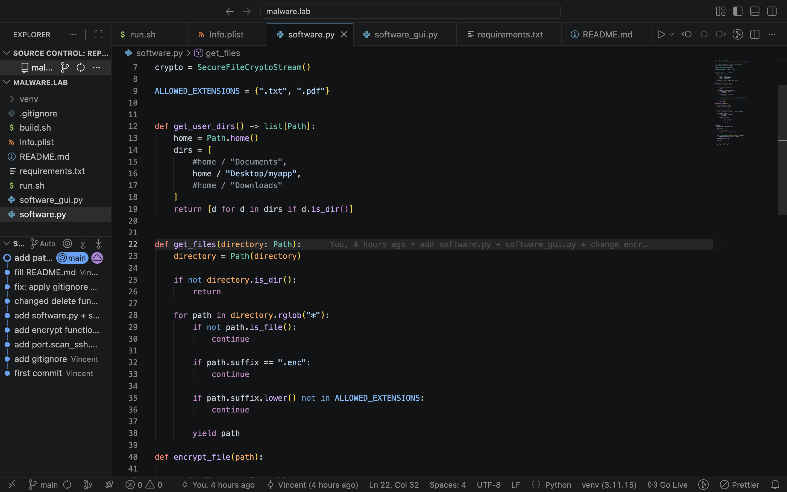
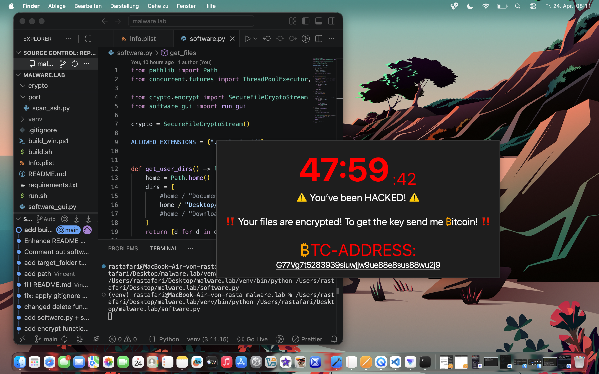

# ransomware.lab (macOS/Linux/Windows)

### Status

Work in progress 🚧

## ⚠️

If you have a folder named myapp on your Desktop rename it and build a new one for the lab by execute build.sh.
choose files by adding os sepcific paths to the get_user_dirs() inside of software.py
add extansion like .png or .exe to ALLOWED_EXTANSIONS if you want more files to be processed !

# What is does

1. The data stealer is initiated via the main() function in software.py, using either Data Stealer Logic 1 and/or Data Stealer Logic 2.

With Logic 1, the entire folder structure is sent to the listener (server).

Logic 2 sends a calculated number of the most important detected files, depending on the upload speed (see server/get_important_files.py).

2. After stealing the data, all files in the paths from the get_user_dirs() function (software.py) will be copied and the copies gets recursively encrypted.

3. The original files will be deleted



tested: m1 arm64

---

## Requirements

- Git
- Python 3.11 (recommended)
- pip
- venv (included with Python)

---

## Download the Project

### Clone via Git

```bash
git clone https://github.com/permission-bit/ransomware.lab.git
cd ransomware.lab
```



### Or download as ZIP

- Open the repository on GitHub
- Click **Code**
- Select **Download ZIP**
- Extract and open the folder in your terminal

---

## Check Python Version

```bash
python3 --version
```

Recommended:

```bash
Python 3.11.x
```

---

## Create Virtual Environment

### macOS / Linux

```bash
python3.11 -m venv venv
source venv/bin/activate
```

If `python3.11` is not available:

```bash
python3 -m venv venv
source venv/bin/activate
```

---

### Windows PowerShell

```powershell
py -3.11 -m venv venv
venv\Scripts\Activate.ps1
```

---

### Windows CMD

```cmd
py -3.11 -m venv venv
venv\Scripts\activate.bat
```

---

## Download software to install

### Execute installer.py

```
python installer.py
```

## that script will install tools like pyinstaller to build the app.

## Install Dependencies

```bash
pip install --upgrade pip
pip install -r requirements.txt
```

---

## Run the Project

### macOS / Linux

```bash
python3 software.py
```

or

```bash
python software.py
```

### Windows

```powershell
python software.py
```

---

## Generate requirements.txt

```bash
pip freeze > requirements.txt
```

---

## Typical Setup Workflow

### macOS / Linux

```bash
git clone https://github.com/VincentNaujoks/malware.lab.git
cd malware.lab
python3.11 -m venv venv
source venv/bin/activate
pip install --upgrade pip
pip install -r requirements.txt
chmod +x build.sh
./build.sh
```

---

# KILL THE APP

## Linux/MacOS

### if you built and started the ransomware.app (ransomware) and dont know how to close it? Then try:

On MacOS .app extansion will be hide except you watch the info but its the same as just ransomware

```bash
pkill ransomware
```

## kill process (python)

### if you used VSCode just close the terminal

### if a Terminal appears try to close it and give permission to kill the process!

## If you run with: python software.py

```
pkill -f "software.py"
```

---

### Windows PowerShell

```powershell
git clone https://github.com/VincentNaujoks/malware.lab.git
cd malware.lab
py -3.11 -m venv venv
venv\Scripts\Activate.ps1
pip install --upgrade pip
pip install -r requirements.txt
```

---

## Project Structure

```text
malware.lab/
├── software.py
├── requirements.txt
├── README.md
├── .gitignore
├── crypto/
├── port/
└── venv/            # do not commit
```

---

## Important Notes

- Do NOT commit `venv/`
- Do NOT commit `.env`, keys, or sensitive data
- Always activate your virtual environment before running the project
- If a module is missing:

```bash
pip install MODULE_NAME
pip freeze > requirements.txt
```

---

## Troubleshooting

### python3.11 not found

```bash
python3 -m venv venv
```

---

### No module named ...

```bash
which python
which pip
```

They must point to your `venv`.

---

### Windows execution policy error

```powershell
Set-ExecutionPolicy -Scope CurrentUser RemoteSigned
```

---

## Legal Disclaimer

This project is provided strictly for educational and authorized testing purposes only.  
Any use of this software on systems, networks, or data without explicit prior permission from the rightful owner is illegal and may result in civil and criminal liability.

The author assumes no responsibility or liability for any misuse, damage, or legal consequences arising from the use of this project.  
By using this software, you agree to comply with all applicable local, national, and international laws.

---

## License

Use only if a license file is included in this repository.
